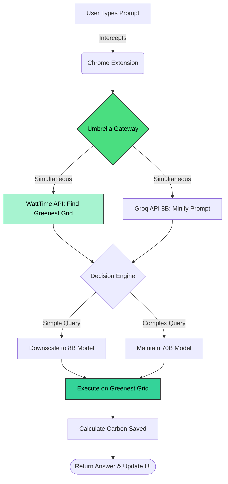

# ☂️ Project Umbrella 
**The Green AI Router & Prompt Minifier**

[](#)
[](https://opensource.org/licenses/MIT)

> **The Problem:** LLMs are incredibly resource-heavy. Developers and consumers waste massive amounts of energy running overly complex models on dirty power grids with unnecessarily "fluffy" prompts.
> 
> **The Solution:** Project Umbrella intercepts your AI queries, minifies them, and dynamically routes them to the global server grid currently running on the cleanest renewable energy.

## 🎥 Live Demo & Installation

Since the Chrome Web Store review process takes 2+ days, we have provided the fully functional extension here for the hackathon judges! 

**1. Watch the Demo Video:**
[👉 Click here to watch the 2-minute Project Umbrella demo on YouTube](https://youtu.be/Exl0DyCB1zU)

**2. Test it Yourself (Local Installation):**
You can run this extension on your own machine in 3 easy steps:
1. Download the `Project-Umbrella-Extension.zip` file from this repository and extract it.
2. Open Chrome and navigate to `chrome://extensions/`.
3. Turn on **Developer mode** (top right), click **Load unpacked**, and select the extracted folder. 
*Note: The extension is fully connected to our live Render backend!*

## ✨ Core Features

* **⚡️ The Prompt Minifier:** Uses a lightning-fast intermediary model (`llama-3.1-8b-instant`) to aggressively strip conversational filler from your prompt, preserving only the core instructions to reduce compute overhead.
* **🌍 Eco-Routing API Gateway:** Pings the WattTime API in real-time to analyze global grid emissions. It routes your final query to the region with the lowest carbon intensity at that exact moment.
* **🧠 Dynamic Model Downscaling:** Umbrella evaluates the complexity of your optimized prompt. Simple queries are automatically downscaled to 8B models, while complex tasks are routed to heavy-lifter 70B models, maximizing energy efficiency.
* **🛡️ Graceful Degradation:** Built with enterprise-grade safety nets. If external grid APIs fail, Umbrella falls back to global averages to ensure the user pipeline never crashes.
* **📊 Live Impact Dashboard:** A persistent Chrome Extension UI that tracks your lifetime carbon savings (in grams of CO2) across all queries.

## 🏗️ System Architecture

1. **Frontend (Chrome Extension V3):** The UI layer where users input queries and view their carbon dashboard.
2. **Express.js Gateway:** The backend traffic cop.
3. **Concurrent Processing:** Simultaneously fetches grid cleanliness data while optimizing the prompt.
4. **Execution & Math Engine:** Routes to the greenest grid, calculates token/character deltas, applies downscale bonuses, and returns the response.



## 🏆 Why It Matters (The Impact)

Most AI tools blindly execute heavy models regardless of the query's complexity, wasting massive amounts of energy. 
- **The Overhead:** 1 query on a 70B model uses significantly more energy than an 8B model. 
- **The Grid Problem:** AI Inference currently relies heavily on dirty, fossil-fuel-powered data centers.

By intelligently intercepting, minifying, and eco-routing queries to renewable energy grids, Umbrella proves that we don't have to sacrifice AI performance for environmental sustainability. Every query saved is a step towards **Net-Zero AI**.

## 💻 Tech Stack

* **Frontend:** HTML, CSS, Vanilla JS (Manifest V3 Chrome Extension)
* **Backend:** Node.js, Express.js
* **AI Orchestration:** Groq API (`llama-3.1-8b-instant` for minification, `llama-3.3-70b-versatile` for execution)
* **Grid Data:** WattTime V2 API
* **Environment:** Google Antigravity Agent Workspace

## 🚀 How to Run Locally

1. Clone the repository.
2. Navigate to the `backend/` directory and install dependencies:
   ```bash
   npm install
   ```
3. Create a `.env` file in the `backend/` directory and add your keys:
   ```env
   PORT=3000
   WATTTIME_USER=your_username
   WATTTIME_PASS=your_password
   GROQ_API_KEY=your_groq_key
   ```
4. Start the gateway server:
   ```bash
   npx nodemon server.js
   ```
5. **Load the Extension:** Open Chrome, go to `chrome://extensions/`, enable "Developer Mode", click "Load Unpacked", and select the `extension/` folder.

Built with 💚 for a sustainable AI future.
